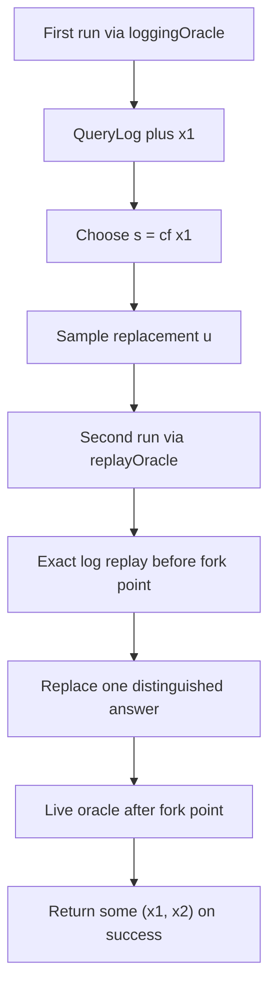

# Replay Fork Design Sketch

This note sketches an additive replay-based fork design for `VCVio`.
It is intended to live beside the existing seed-based fork infrastructure, not replace it.

The immediate motivation is the Fiat-Shamir setting in
[`VCVio/CryptoFoundations/FiatShamir.lean`](../../VCVio/CryptoFoundations/FiatShamir.lean),
where the current fork construction shares only the rewound challenge oracle and does not
share arbitrary ambient `unifSpec` randomness.

## Goal

Add a parallel replay-based fork path that:

- preserves the current seed-based API and proofs in
  [`VCVio/CryptoFoundations/SeededFork.lean`](../../VCVio/CryptoFoundations/SeededFork.lean)
- uses query logging from
  [`VCVio/OracleComp/QueryTracking/LoggingOracle.lean`](../../VCVio/OracleComp/QueryTracking/LoggingOracle.lean)
- replays the first-run oracle transcript exactly up to the selected fork point
- changes exactly one distinguished oracle answer at that fork point
- allows later work in Fiat-Shamir to share ambient `unifSpec` randomness by replay rather than
  by pre-generated seed coverage

## Non-Goals

This sketch does not propose:

- editing the current seed-based `fork` definitions
- migrating existing proofs away from the seed-based path
- proving the replay-based theorems in the same change
- forcing a final API name today

The current seed-based fork remains the canonical implementation for settings that already fit it.

## Current Seed-Based Architecture

Today the core fork path is built around pre-generated seeds:

- `fork`
- `seededForkWithSeedValue`
- `generateSeed`
- `QuerySeed.takeAtIndex`
- `QuerySeed.addValue`
- `le_probEvent_isSome_seededFork`

The key operational idea is:

```lean
def seededFork (main : OracleComp spec α)
    (qb : ι → ℕ) (js : List ι) (i : ι)
    (cf : α → Option (Fin (qb i + 1))) :
    OracleComp spec (Option (α × α)) := do
  let seed ← liftComp (generateSeed spec qb js) spec
  let x₁ ← (simulateQ seededOracle main).run' seed
  match cf x₁ with
  | none => return none
  | some s =>
    let u ← liftComp ($ᵗ spec.Range i) spec
    if (seed i)[↑s]? = some u then
      return none
    else
      let seed' := (seed.takeAtIndex i ↑s).addValue i u
      let x₂ ← (simulateQ seededOracle main).run' seed'
      if cf x₂ = some s then
        return some (x₁, x₂)
      else
        return none
```

This design is good for settings where the relevant randomness can be represented as bounded,
pre-generated oracle seed material.

The proofs that should remain untouched include:

| Current declaration | Role |
| --- | --- |
| `seededFork` | Public seeded-fork operation |
| `seededForkWithSeedValue` | Deterministic core with fixed seed and replacement value |
| `cf_eq_of_mem_support_seededFork` | Support-level characterization of successful forks |
| `le_probOutput_seededFork` | Per-fork-point lower bound |
| `probOutput_none_seededFork_le` | Aggregate failure bound |
| `le_probEvent_isSome_seededFork` | Packaged success-event version of the seeded forking lemma |

The seed-based support lemmas also depend heavily on
[`VCVio/OracleComp/QueryTracking/SeededOracle.lean`](../../VCVio/OracleComp/QueryTracking/SeededOracle.lean)
and
[`VCVio/OracleComp/Constructions/GenerateSeed.lean`](../../VCVio/OracleComp/Constructions/GenerateSeed.lean).

## Why Replay Is Needed

The current Fiat-Shamir fork setup uses:

- `nmaHashQueryBound`, which bounds only hash queries and leaves `.inl` `unifSpec` queries unrestricted
- `FiatShamir.runForkTrace`, which forwards `.inl` `unifSpec` queries live
- `fork`, which currently shares only the seeded distinguished oracle family

So the present proof attempt implicitly wants the following implication:

1. the two fork runs agree on the selected fork index `s`
2. therefore they also agree on the selected query target at that position

That implication is not justified when ambient `unifSpec` randomness is still live in the replayed
run.
The first and second runs may diverge before the selected fork point if they see different
`unifSpec` samples.

This is the semantic gap behind the current Fiat-Shamir proof bottleneck.

## Replay-Based Design

The replay-based path should be additive, with a new parallel API.
For now, the most natural future Lean file would be
[`VCVio/CryptoFoundations/ReplayFork.lean`](../../VCVio/CryptoFoundations/ReplayFork.lean),
leaving [`VCVio/CryptoFoundations/SeededFork.lean`](../../VCVio/CryptoFoundations/SeededFork.lean) unchanged.

Likely public declarations:

- `forkReplay`
- `forkReplayWithTraceValue`
- a replay oracle implementation, likely stateful

The first run should use `loggingOracle` and record the full interleaved query transcript:

```lean
@[reducible] def QueryLog (spec : OracleSpec.{u, v} ι) : Type (max u v) :=
  List ((t : spec.Domain) × spec.Range t)
```

That log is ordered across oracle families, so it is the right object for replaying ambient
randomness and distinguished oracle calls in one transcript.

### Replay State

The replay state should contain at least:

- the first-run `QueryLog spec`
- a cursor into that log
- the distinguished oracle family `i`
- the selected fork index `s`
- the fresh replacement answer `u`
- a flag recording whether the fork point has already been crossed
- a flag or error state recording whether replay has mismatched the logged prefix

In prose, the replay oracle behaves as follows:

1. Run the first execution under `loggingOracle`, producing `x₁` and `log₁`.
2. If `cf x₁ = none`, fail immediately.
3. If `cf x₁ = some s`, sample a fresh replacement answer `u` for the distinguished family.
4. Re-run the computation under a replay oracle that checks each query against `log₁`.
5. Before the fork point, replay must match the logged prefix exactly.
6. At the selected distinguished query, return `u` instead of the logged answer.
7. If the second run deviates from the logged prefix before the fork point, fail the fork attempt.
8. After the fork point, fall through to the live oracle.



## Why This Is Additive

This path does not need to disturb the current seed-based machinery.

The intended split is:

- `Fork.lean` continues to host the seed-based fork and its theorems
- `ReplayFork.lean` would host the replay-based fork and its own theorem family
- downstream users choose the fork style that matches their randomness model

This means the current proof stack stays valid and available.
The replay path merely broadens the settings where a forking argument can be applied.

## Parallel Theorem Stack

The replay-based path should mirror the existing theorem stack rather than mutate it.

| Seed-based theorem | Replay-based analogue |
| --- | --- |
| `seededForkWithSeedValue` | `forkReplayWithTraceValue` |
| `cf_eq_of_mem_support_seededFork` | support lemma for successful replay forks |
| `le_probOutput_seededFork` | per-fork-point replay lower bound |
| `probOutput_none_seededFork_le` | replay failure bound |
| `le_probEvent_isSome_seededFork` | packaged replay success-event theorem |

The most important new replay lemmas are likely:

1. First-run faithfulness: logging the first run does not change the output distribution.
2. Replay-prefix support lemma: successful replay implies exact agreement with the logged query
   prefix before the fork point.
3. Same-target lemma: on successful replay, the selected distinguished query in both runs has the
   same query input.
4. Single-change lemma: the two runs differ only in the chosen distinguished oracle answer at the
   selected position.
5. Replay runtime theorem: replay does not create uncontrolled pre-fork oracle behavior.
6. Replay forking theorem: a replay analogue of `le_probEvent_isSome_seededFork`.

The conceptual heart of the redesign is item 2.
Unlike the seed-based path, replay gets to prove prefix agreement by explicit transcript matching,
not by arguing that both runs consume the same pre-generated seed.

## Fiat-Shamir Integration

The replay design is especially useful for
[`VCVio/CryptoFoundations/FiatShamir.lean`](../../VCVio/CryptoFoundations/FiatShamir.lean).

The current forkable managed-RO NMA setup lets ambient `unifSpec` randomness stay live.
That is fine operationally, but it does not fit the current seed-based fork proof.

Replay would let the Fiat-Shamir reduction keep that ambient randomness model:

- first-run `unifSpec` and RO calls are logged in one interleaved transcript
- the second run is forced to replay the same ambient randomness prefix
- only the chosen distinguished RO answer is changed at the fork point
- successful replay gives the exact prefix-sharing fact needed to justify “same target, different
  challenge”

This is the intended repair path for `FiatShamir.runForkTrace` and `euf_nma_bound`, while keeping
the current seed-based fork available for simpler settings.

## Suggested Future File Split

If this design is implemented later, a clean additive split would be:

| File | Purpose |
| --- | --- |
| `VCVio/CryptoFoundations/SeededFork.lean` | Seed-based fork, unchanged by the replay path |
| `VCVio/CryptoFoundations/ReplayFork.lean` | New replay-based fork API and theorem stack |
| `VCVio/OracleComp/QueryTracking/LoggingOracle.lean` | Existing logging infrastructure, reused |
| `VCVio/OracleComp/QueryTracking/Structures.lean` | Existing `QueryLog` and tracking structures, reused |

This keeps the redesign discoverable without making the current fork file even longer.

## Open Design Choices

The sketch leaves a few choices intentionally open:

- whether replay mismatch should return `none` directly or a richer failure result internally
- whether the distinguished query selector should remain `cf : α → Option (Fin (qb i + 1))` or be
  generalized slightly for replay
- whether replay runtime bounds should be phrased pathwise first or expected-cost first
- whether the replay path should target only the Fiat-Shamir use case at first or be fully generic

These can be decided when the actual Lean implementation begins.

## Recommended Next Step

When implementation work starts, the first milestone should be a pure infrastructure file:

1. define the replay oracle state
2. define the replay oracle semantics
3. define `forkReplayWithTraceValue`
4. prove first-run faithfulness and replay-prefix support lemmas

Only after that should the Fiat-Shamir reduction be migrated to use the replay-based path.
